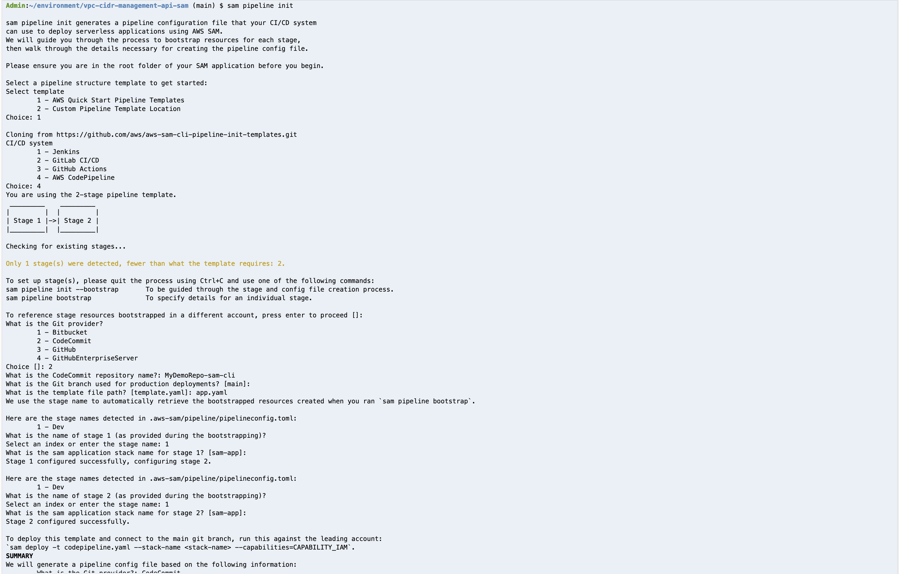

# CI/CD of Serverless API using AWS CodePipeline generated using AWS SAM CLI 

This project uses the AWS SAM CLI to generate a AWS CodePipeline to manage the CI/CD of a Serverless API.
AWS SAM CLI commands - 'sam pipeline bootstrap' and 'sam pipeline init' are used to generate a cookie-cutter pipeline and the necessary AWS IAM resources.
The generated pipeline can be edited to configure the required stages, and buildspec steps.
A pre-configured AWS CodePipeline (with AWS CodeBuild buildspec for unit-tests, integration-tests), and steps to deploy the pipeline are provided for reference. 


## Product Versions
* AWS SAM CLI - used for local development, build, package and deploy the API
* Python Behave 1.2.6 BDD framework - Integration tests to validate the API deployment
* AWS SDK for Python (Boto3) V1.18
* Python 3.7

## Directory structure
```
├── README.md                                     <-- This documentation file
├── cidr_management                               <-- Source code for Lambda functions
├── cidr_management/config                        <-- Env config variables
├── cidr_management/utils                         <-- Functions shared by multiple Lambdas
├── app.yaml                                      <-- AWS SAM Template for the app to be deployed
├── samconfig.toml                                <-- AWS SAM config file, contains config vars for the app and pipeline
├── cidr_management/requirements.txt              <-- Python dependencies
├── sam_pipeline                                  <-- pre-configured buildspecs for AWS CodeBuild stages
├── sam_codepipeline.yaml                         <-- pre-configured codepipeline
├── pipeline                                      <-- generated by 'sam pipeline init'  command
└── codepipeline.yaml                             <-- generated by 'sam pipeline init' command
```

## Architecture

Cidr API deployed using AWS SAM CLI. 
The OpenAPI doc for this API is located at [docs/openapi3.yml](docs/openapi3.yml)


CI/CD of Cidr API using AWS CodePipeline generated using AWS SAM CLI 


## Pre-requisites
    * Install Python3.7
    * Install AWS SAM-CLI
    * (Optional)Get S3 bucket name, if you would like to re-use an existing bucket for AWS SAM CLI artifacts


## Setup AWS CodeCommit repository
```shell
# Configure AWS named profile for the required {account,region} environment
aws configure --profile default

#Create AWS CodeCommit repo
aws codecommit create-repository --repository-name MyDemoRepo-Sam-Cli

#Create HTTPS Git credentials for AWS CodeCommit
#Add remote 
git remote add codecommit https://git-codecommit.us-west-2.amazonaws.com/v1/repos/MyDemoRepo-Sam-Cli

#Push to git
git push codecommit main
```

## Local env setup, unit tests
```shell
python3 -m pip install --user --upgrade pip
python3 -m venv env
source env/bin/activate

#Install dependencies
pip install -r cidr_management/requirements.txt

# Run Unit tests
pytest ./

```

## CI/CD with AWS CodePipeline generated by AWS SAM CLI 
* ### Run 'sam pipeline bootstrap' - This sets up AWS IAM roles required for the pipeline 

```
# Run 'sam pipeline bootstrap' to create required iam roles
# Create a single stage named 'Dev', use us-west-2, create a new bucket, use default profile
# For this demo only 1 stage is required. For cross-account deploy, create another stage named 'Prod' with respective params
sam pipeline bootstrap
```
* ### Example output of 'sam pipeline bootstrap'. 
  For this demo, only one stage 'Dev' is required.
  Note the bucket name created in the end 'Summary'. Update samconfig.toml with the bucket name


* ### Run 'sam pipeline init' - This generates the CodePipeline (pipeline.yaml, pipeline/)
```shell 
# Sam pipeline init  - To generate a CodePipeline pipeline
# The below command will generate a 2-stage pipeline. For this demo, provide 'Dev' as both the 1st and 2nd stage.
sam pipeline init
```
* ### Example output of 'sam pipeline init'. 



## Deploy pre-configured AWS CodePipeline 
(The provided sam_codepipeline.yaml is an edited version of pipeline.yaml)
```shell 
# Update parameters section of sam_codepipeline.yaml with template parameters from pipeline.yaml
sam deploy --template sam_codepipeline.yaml --config-env default

```


## From the AWS Console, verify Integration Test report in Developer Tools -> CodeBuild -> Build -> Report groups


## License

This library is licensed under the MIT-0 License. See the LICENSE file.
